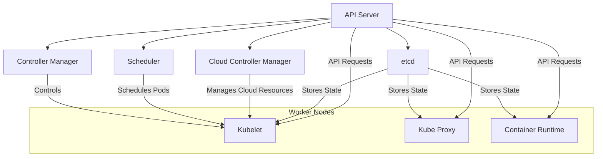

To understand Kubernetes and its architecture thoroughly, let's start with a detailed explanation and then dive into practical projects with visual aids.

### **Understanding Kubernetes Cluster Architecture**

#### **What is a Kubernetes Cluster?**

A Kubernetes cluster is a set of machines (virtual or physical) that run Kubernetes software and work together to deploy, manage, and scale containerized applications. The cluster architecture is designed to provide high availability, scalability, and fault tolerance.

#### **Kubernetes Architecture Overview**

The Kubernetes architecture consists of two main components:

1. **Master Node (Control Plane)**
    - **API Server**: The API Server is the entry point for all REST API requests. It exposes the Kubernetes API and handles the API calls from clients, including `kubectl`, other control plane components, and external applications.
    - **Controller Manager**: The Controller Manager runs controller processes that regulate the state of the cluster. For instance, it manages replication controllers, deployment controllers, and ensures that the desired state of the cluster is maintained.
    - **Scheduler**: The Scheduler is responsible for assigning pods to nodes based on resource availability, constraints, and policies.
    - **etcd**: `etcd` is a distributed key-value store that holds all the cluster data, including configuration and state. It is the source of truth for the cluster.
    - **Cloud Controller Manager**: This component interacts with cloud providers to manage resources such as load balancers and storage, specific to the cloud environment.

2. **Worker Nodes**
    - **Kubelet**: An agent that runs on each worker node, ensuring that containers are running in a pod as expected and reporting their status to the API Server.
    - **Kube Proxy**: Manages network routing and load balancing for services within the cluster, ensuring that network traffic is directed correctly to the appropriate pods.
    - **Container Runtime**: Software responsible for running containers, such as Docker or containerd.

#### **Kubernetes Architecture Diagram**

Here's a Mermaid diagram to visualize the Kubernetes cluster architecture:

